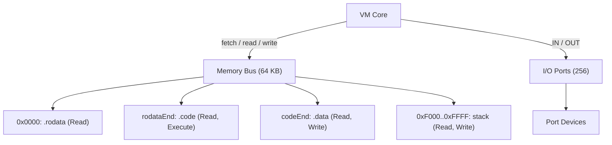

# FVM

A hobby fantasy VM I built to scratch several itches at once. I wanted to understand how low-level things actually work, but writing real assembly is not fun: x86 has decades of legacy baggage, ARM requires hardware I do not have or messing with QEMU. So I built my own machine, my own bytecode format, and my own assembly language with a light ARM flavor, and now writing assembly is fun because I am also the one designing what it can do.

The side effect is that it doubles as a sandbox for OS concepts. I am interested in writing a tiny kernel, and a custom VM is a much friendlier place to experiment with things like memory protection, privilege levels, and interrupt handling than trying to boot real hardware.

The encoding is intentionally wasteful: one byte per opcode, one byte per register operand. Performance is not the point. Simplicity of implementation and freedom to get things wrong and learn from it are.

## Long-term goals

Things I plan to get to eventually, roughly in order:

- privilege bit to distinguish kernel mode from user mode
- interrupt vector table for hardware faults and software syscalls
- a basic kernel running on the VM itself
- virtual devices: display output, keyboard input
- a step debugger with register inspection and direct memory editing
- simple games (Pong is the benchmark)
- a basic shell
- a minimal filesystem over a virtual disk
- a small compiled language targeting FVM bytecode, something C-like but without C's inconsistencies (looking at you, `type name[]` declaration syntax and the do-while scoping rules)

The foundations are mostly in place. The hard work is far from done.

## Architecture



### VM state

- 16 general-purpose 16-bit registers (`r0`..`r15`), with byte-lane access via `r0l` / `r0h`
- `sp` (stack pointer), also 16-bit, writable like any general register
- Zero, carry, and negative flags
- Opcode dispatch through a static jump table; each entry carries the mnemonic string and the handler proc

### Memory bus

The bus owns the full 64 KB backing array and a list of regions that partition the address space. Each region carries a permission set: `Read`, `Write`, `Execute`. The bus enforces permissions on every access and returns an error for unmapped addresses or permission violations. The VM halts on any bus error.

Peripheral devices attach to regions via `deviceRead`/`deviceWrite` callbacks; the bus delegates to them instead of touching the backing array.

### I/O ports

256 independent byte-addressable ports, accessed with `IN` and `OUT`. Each port has an independent device attached. The CLI `--map` flag wires ports to files or stdio at startup.

## Instruction set

| Group | Instructions |
|-------|-------------|
| Control | `NOP`, `HALT` |
| Data movement | `MOV`, `ZEXT`, `SEXT` |
| Stack | `PUSH`, `POP` |
| Arithmetic | `ADD`, `SUB` |
| Bitwise | `AND`, `OR`, `XOR`, `NOT` |
| Comparison | `CMP` |
| Jumps | `JMP`, `JZ`, `JNZ`, `JC`, `JN` (immediate and register variants) |
| Subroutines | `CALL`, `RET` |
| Memory | `LOAD`, `STORE` |
| Peripherals | `IN`, `OUT` |

All jump and call instructions come in two forms: an immediate address/label operand and a register operand for indirect jumps.

## Assembly syntax

```asm
# comment

.rodata
    msg:   db "Hello", 0      # string bytes, null must be explicit
    table: dw 42, 0x1234      # 16-bit words, big-endian

.code
main:
    MOV  r0, msg              # r0 = address of msg (label as imm16)
    MOV  r1l, 'A'             # char literal into byte lane
    LOAD r1l, r0              # load byte at address r0 into r1l
    OUT  0, r1l               # write byte to port 0
    CALL print
    HALT

print:
    RET

.data
    counter: dw 0             # mutable initialized word
```

Local labels scope to the preceding global label, so `.loop` under `multiply:` is `multiply.loop` internally and does not conflict with `.loop` anywhere else.

## Running

```bash
# assemble and run directly (no object file written)
just asm examples/io.fa

# with full debug output
just asm examples/io.fa --debug-level lvlDebug

# single-step mode, prints registers each cycle
just asm examples/io.fa --step

# map port 0 to stdout in hex repr
just asm examples/io.fa --map "0:::hex"

# map port 0 to a file for input
just asm examples/io.fa --map "0:data.bin:in:raw"

# assemble to a .fo object file
just fvm assemble examples/io.fa

# run a .fo object file
just run examples/io.fo --map "0:::hex"
```

Port map format: `port:path:mode:repr`

- `port`: 0-255, required
- `path`: file path, or `stdin`/`stdout`/`stderr`; defaults to stdin for `in` mode and stdout for `out` mode
- `mode`: `in`, `out`, or `both`; defaults to `both`
- `repr`: `raw` (binary) or `hex` (one `0xNN` line per byte); defaults to `raw`

## Development

```bash
just build    # compile to ./bin/fvm
just test     # run tests
just clean    # remove build artifacts
```

Tbh the tests are mostly vibecoded; writing tests is not my strongest suit. In practice I test by running examples with `--debug-level lvlDebug`, stepping through cycles with `--step`, or checking output with `--map "0:::hex"`.

## License

MIT, so do whatever you want with it. That said, I am not accepting pull requests. This is an exploratory project, not a product: I want the freedom to break things, redo things, and deliberately implement something the worst possible way just to understand it better. Accepting contributions would get in the way of that. If you want to take it somewhere else, fork it; I would genuinely enjoy watching what you do with it.