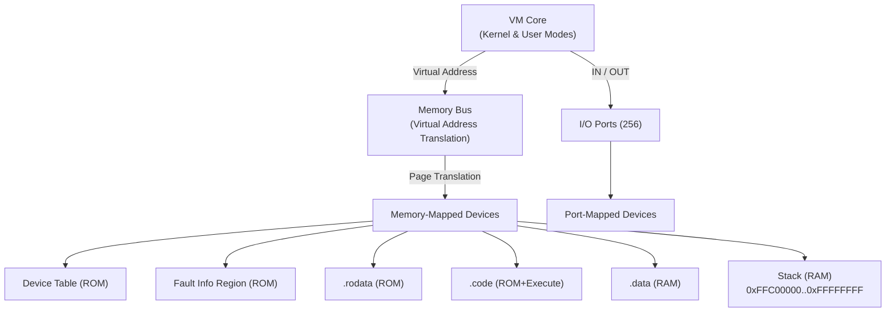

# FVM

A hobby fantasy VM I built to scratch several itches at once. I wanted to understand how low-level things actually work, but writing real assembly is not fun: x86 has decades of legacy baggage, ARM requires hardware I do not have or messing with QEMU. So I built my own machine, my own bytecode format, and my own assembly language with a light ARM flavor, and now writing assembly is fun because I am also the one designing what it can do.

The side effect is that it doubles as a sandbox for OS concepts. I am interested in writing a tiny kernel, and a custom VM is a much friendlier place to experiment with things like memory protection, privilege levels, and interrupt handling than trying to boot real hardware.

The encoding is intentionally wasteful: one byte per opcode, one byte per register operand. Performance is not the point. Simplicity of implementation and freedom to get things wrong and learn from it are.

## Long-term goals

Things I plan to get to eventually, roughly in order:

- a basic kernel running on the VM itself
- virtual devices: display output, keyboard input
- a step debugger with register inspection and direct memory editing
- simple games (Pong is the benchmark)
- a basic shell
- a minimal filesystem over a virtual disk
- a small compiled language targeting FVM bytecode, something C-like but without C's inconsistencies (looking at you, `type name[]` declaration syntax and the do-while scoping rules)

The foundations are mostly in place. The hard work is far from done.

## Architecture



### VM state

- 16 general-purpose 32-bit registers per mode (`rw0`..`rw15`), with narrower views:
  - `rh0`..`rh15`: 16-bit low half of each register
  - `rb0`..`rb15`: 8-bit low byte of each register
  - Writing a narrower view does not touch bits above it; use `ZEXT` or `SEXT` to promote
- `sp` (stack pointer), 32-bit, writable like any general register
- `cr` (context register), 32-bit, identifies the address space for virtual translation
- `ip` (instruction pointer), 32-bit, not directly writable by general instructions
- `mr` (mapping register), 32-bit privileged register for memory mapping operations
- Zero, carry, and negative flags
- Dual register files: kernel mode and user mode, switching atomically with `DPL`
- VM-resident interrupt vector table (256 entries) and per-entry saved context
- Opcode dispatch through a static jump table; each entry carries the mnemonic string and the handler function

### Memory bus

Configurable address space (default 16 MiB) composed of physical regions, each backed by a RAM device or memory-mapped device. No unmapped virtual addresses without fault; all accesses go through the bus which translates using the active context CR and enforces permissions.

Virtual layout at startup (per context):

- Device table and fault info region (ROM)
- `.rodata` section (ROM)
- `.code` section (ROM + Execute)
- `.data` section (RAM)
- Stack at fixed virtual address `0xFFC00000..0xFFFFFFFF` (RAM)

Each section aligns to 4 KB page boundaries. Pages carry permission bits: Read, Write, Execute. Violations raise interrupt 1.

Virtual address translation uses per-context page tables maintained by the bus in host memory. The `MMAP`, `MUNMAP`, and `MPROTECT` instructions operate on the context in `mr` (mapping register), not the currently active `cr`.

### I/O ports

256 independent byte-addressable ports, accessed with `IN` and `OUT`. Each port has an independent device attached. Port devices include:

- Decimal I/O: reads/writes decimal integers (human-friendly debugging)
- Hex I/O: reads/writes hexadecimal bytes one per line
- Raw I/O: reads/writes raw binary data

Each device routes to an input/output stream configured at startup (stdin, stdout, stderr, or a file).

## Instruction set

| Group | Instructions |
|-------|-------------|
| Control | `NOP`, `HALT` |
| Data movement | `MOV`, `ZEXT`, `SEXT` |
| Stack | `PUSH`, `POP` |
| Arithmetic | `ADD`, `SUB` |
| Bitwise | `AND`, `OR`, `XOR`, `NOT` |
| Comparison | `CMP` |
| Jumps | `JMP`, `JZ`, `JNZ`, `JC`, `JN` (immediate and register variants) |
| Subroutines | `CALL`, `RET` |
| Memory | `LOAD`, `STORE` |
| Interrupts | `SIE`, `INT`, `IRET`, `DPL` |
| Peripherals | `IN`, `OUT` |

All jump and call instructions come in two forms: an immediate address/label operand and a register operand for indirect jumps.

## Assembly syntax

```asm
# This is a comment

.rodata
    msg:   db "Hello", 0      # string bytes, null must be explicit
    table: dw 0x12345678      # 32-bit words, big-endian

.code
main:
    MOV  rw0, msg             # rw0 = address of msg (label as imm32)
    MOV  rb0, 'A'             # char literal into byte lane
    LOAD rb0, rw0             # load byte at address rw0 into rb0
    OUT  0, rb0               # write byte to port 0
    CALL print
    HALT

print:
    RET

.data
    counter: dw 0             # mutable initialized word
```

Registers are 32-bit with three views sharing the same storage:

- `rw0`..`rw15`: full 32-bit general-purpose registers
- `rh0`..`rh15`: 16-bit low half of each `rw` register
- `rb0`..`rb15`: 8-bit low byte of each `rh` register

Writing to `rb0` does not modify bits above the low byte. Mixing views of different widths in a single instruction is an error; use `ZEXT` or `SEXT` to promote first.

Local labels scope to the preceding global label, so `.loop` under `multiply:` is `multiply.loop` internally and does not conflict with `.loop` anywhere else.

## Running

```bash
# Assemble an example into a .fo object file
just asm examples/io.fa --output target/examples/io.fo

# Run a .fo object file with the default 16 MB memory and decimal I/O on port 0
just run target/examples/io.fo

# Run with a RON config file for custom setup
just asm-exec config.ron

# Inline RON config with human-readable memory size
just asm-exec '(
  mem_size: "256mb",
  rom: "target/examples/io.fo",
  devices: [
    (type: "decimal_io", port: 0, input: "stdin", output: "stdout"),
  ],
)'

# Equivalent using raw byte counts (if preferred)
just asm-exec '(
  mem_size: 268435456,
  rom: "target/examples/io.fo",
  devices: [],
)'

# Combine assembler and VM run in one step
just asm-exec '(
  mem_size: "128mb",
  rom: "target/examples/fibo.fo",
  devices: [
    (type: "decimal_io", port: 0, input: "stdin", output: "stdout"),
  ],
)'
```

Memory sizes can be specified as human-readable strings like `"128mb"`, `"2gb"`, `"512kb"` or as raw byte counts. Supported suffixes: `b` (bytes), `kb`, `mb`, `gb`, `tb`. Sizes are case-insensitive and leading/trailing whitespace is ignored.

## Development

```bash
just build    # compile the Rust workspace
just test     # run all Rust tests
just clean    # remove build artifacts
```

The test suite includes unit tests for the assembler, VM core, and integration tests. Interrupt handling has automated coverage via [examples/interrupts.fa](examples/interrupts.fa).

## License

MIT, so do whatever you want with it. That said, I am not accepting pull requests. This is an exploratory project, not a product: I want the freedom to break things, redo things, and deliberately implement something the worst possible way just to understand it better. Accepting contributions would get in the way of that. If you want to take it somewhere else, fork it; I would genuinely enjoy watching what you do with it.